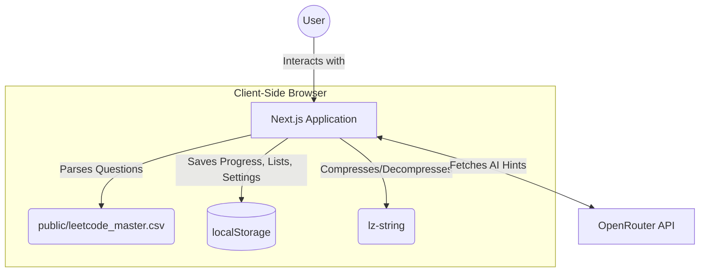

# 🚀 DSA Canvas - Notion-Style LeetCode Tracker

A minimalist, fast, and fully local dashboard to track your Data Structures and Algorithms (DSA) progress. Built with a sleek, Notion-inspired dark mode interface, it allows for seamless progress tracking with advanced bulk actions, custom lists, AI-powered hints, and zero dependencies on external databases.

## ✨ Features

- **🎨 Notion-Inspired UI**: Beautiful dark mode aesthetic with custom scrollbars, typography, and layout mimicking Notion databases.
- **📊 Real-time Statistics**: See your progress at a glance with completion counts broken down by Total, Easy, Medium, and Hard problems.
- **🔍 Advanced Filtering & Search**:
  - Text search by problem name or topics.
  - Custom autocomplete dropdown for Company tags.
  - Difficulty filter (Easy, Medium, Hard).
  - Status filter (Completed, Pending).
  - List filter to view questions belonging to your custom lists.
- **📁 Custom Lists**: Group your problems into custom-made lists (e.g., "Blind 75", "Dynamic Programming Practice", "Microsoft Interview").
- **📈 Difficulty Overrides**: Disagree with the default difficulty of a problem? Easily override it to personalize your learning and metrics.
- **⚙️ Bulk Actions**: Select multiple questions at once to easily add them to lists or change their difficulty in bulk.
- **🤖 Built-in AI Hints via OpenRouter**: Stuck on a problem? You can directly ask for hints! Just configure your OpenRouter API key inside the settings and use top-tier models (default: google/gemini-2.5-flash) to generate markdown-formatted hints or pseudo-code without leaving the app.
- **💾 Compressed Local Persistence**: Your progress, custom lists, overrides, and cached AI hints are all automatically saved and compressed using `lz-string` into your browser's `localStorage` — requiring zero database or backend setup!
- **📄 CSV Powered**: Reads directly from a local `leetcode_master.csv` file, making it incredibly easy to update or swap out your entire question bank at any time.
- **📱 Fully Responsive**: Carefully crafted for comfortable viewing and progress updating across both desktop and mobile devices.

## 🛠️ Tech Stack


- **Framework**: Next.js 14 (App Router)
- **Library**: React 18
- **Language**: TypeScript
- **Styling**: Tailwind CSS
- **Icons**: Lucide React
- **CSV Parsing**: PapaParse
- **Storage/Compression**: LZ-String
- **Markdown Rendering**: React Markdown

## 🏗️ Architecture Diagram



## 🚀 Setup Instructions

### Prerequisites
- **Node.js**: v18 or newer
- **Git**

### Installation

1. Clone the repository:
```bash
git clone https://github.com/your-username/dsa_fe.git
cd dsa_fe
```

2. Install the dependencies:
```bash
npm install
# or
yarn install
# or
pnpm install
```

3. Run the development server:
```bash
npm run dev
# or
yarn dev
# or
pnpm dev
```

Open [http://localhost:3000](http://localhost:3000) with your browser to launch the dashboard.

## 🗂️ Data Management (CSV)

The application reads the master question bank from a CSV file located at `public/leetcode_master.csv`.

To update your question list or bring your own dataset, simply modify or replace this file. The app expects the CSV to have the following header columns:
- `Title`
- `Difficulty`
- `Frequency`
- `Acceptance Rate`
- `Topics` (comma separated)
- `Company Count`
- `Companies` (pipe `|` separated)
- `Link`

## 🔒 Data Storage & Privacy

All of your data—completion checkmarks, custom lists, generated AI hints, and configuration keys—are stored entirely locally using your browser's **`localStorage`**. No private data is ever sent to an external server (with the sole exception of sending prompts to OpenRouter when you manually request an AI hint).

**Important Notes on Storage:**
- **Different Devices/Browsers:** Tracking data is completely isolated to the device and browser you are currently using. Progress will not naturally sync across different machines or your phone.
- **Same Browser Profile:** If two people use the exact same browser profile on the same computer, their tracking data *will* mix as they share the same `localStorage` environment.
- **Want Cross-Device Sync?** To support multiple users or cross-device syncing, you can fork this repo and integrate a database (like Supabase, Firebase) and an authentication provider (like NextAuth).

## 🤖 Configuring AI Hints

To use the AI Hint generation feature:
1. Obtain an API Key from [OpenRouter](https://openrouter.ai/).
2. On the DSA Canvas website, click on the **⚙️ Settings** icon.
3. Paste your OpenRouter API key and set your desired model string (default is `google/gemini-2.5-flash` since it is fast and cheap).
4. Click on any question to open its modal, and use the **Generate AI Help** button!

## 🙏 Credits & Data Source

A massive thank you to [**liquidslr**](https://github.com/liquidslr/interview-company-wise-problems) for compiling and maintaining the original LeetCode company tags dataset that historically powers this dashboard's core problem set.
